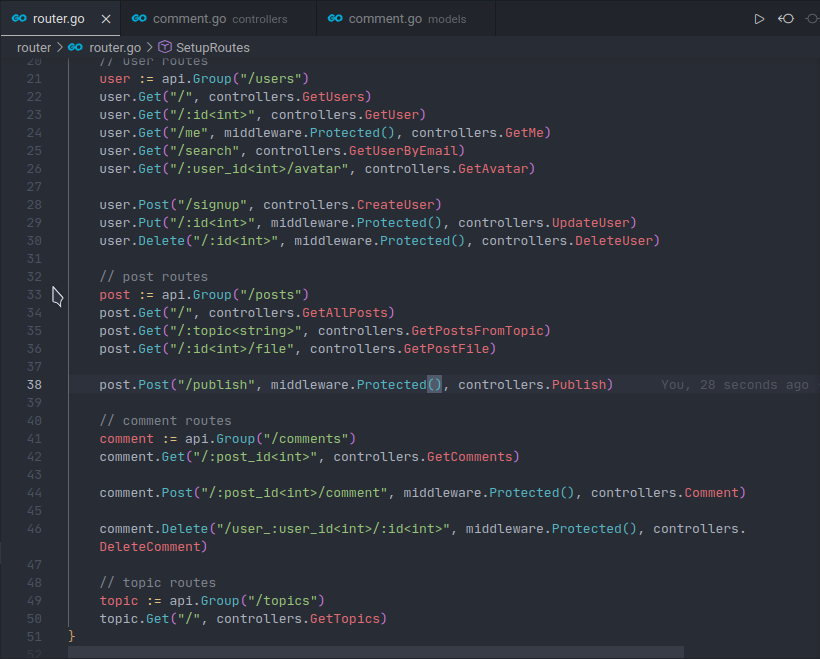

# Backend Ampio

This is the backend of the application Ampio that will be presented on the 2nd Edition of the DevHunt organised by ENI Fianarantsoa.

## Development

### Start the application

```bash
go run app.go
```

### Use local container

```
# Clean packages
make clean-packages

# Generate go.mod & go.sum files
make requirements

# Generate docker image
make build

# Generate docker image with no cache
make build-no-cache

# Run the projec in a local container
make up

# Run local container in background
make up-silent

# Run local container in background with prefork
make up-silent-prefork

# Stop container
make stop

# Start container
make start
```

## Production

```bash
docker build -t gofiber .
docker run -d -p 3000:PORT gofiber ./app -prod
```

PORT should be replaced with the one in .env file

Go to <http://localhost:PORT>:

## API Reference



### Users

#### Login

```http
  POST /api/auth/login
```

```json
{
    "identity": "nanta", # username or email
    "password": ""
}
```

#### Get all users

```http
  GET /api/users
```

#### Get user by id

```http
  GET /api/users/:id
```

| Parameter | Type     | Description                       |
| :-------- | :------- | :-------------------------------- |
| `id`      | `int` | **Required**. Id of user to fetch |

#### Get current authenticated user

```http
  GET /api/users/me
```

#### Search user

```http
  GET /api/users/search
```

```json
{
  "query": "<word to search for>"
}
```

#### SignUp

```http
  POST /api/users/signup
```

```json
{
    "matricule": 0000,
    "username": "john",
    "email": "johndoe@gmail.com",
    "avatar": "pdp.jpg",
    "password": "password"
}
```

#### Get user by id

```http
  PUT /api/users/me/password
```

```json
{
    "old_password": "",
    "new_password": "",
    "confirm_pass": ""
}
```

| Auth | Type     | Description                       |
| :-------- | :------- | :-------------------------------- |
| `bearer`      | `jwt` | **Required**. The user's token for the jwt |

#### Delete user

```http
  DELETE /api/users/delete
```

```json
{
  "password": ""
}
```

### Posts

#### List all Posts

```http
  GET /api/posts
```

#### Publish a post

```http
  POST /api/posts/publish
```

```json
{
    "title": "Title",
    "content": "Content",
    "topics": "Topic",
    "file": "file.pdf"
}
```

| Auth | Type     | Description                       |
| :-------- | :------- | :-------------------------------- |
| `bearer`      | `jwt` | **Required**. The user's token for the jwt |

### Comments

#### Get all comments in a post

```http
  GET /api/comments/:post_id
```

| Parameter | Type     | Description                       |
| :-------- | :------- | :-------------------------------- |
| `post_id`      | `int` | **Required**. Id of post where to fetch comments |

#### Post a comment

```http
  POST /api/comments/:post_id/comment
```

```json
{
    "content": "This is a comment to be published",
    "file": "file.pdf"
}
```

| Parameter | Type     | Description                       |
| :-------- | :------- | :-------------------------------- |
| `post_id`      | `int` | **Required**. Id of post where to fetch comments |

| Auth | Type     | Description                       |
| :-------- | :------- | :-------------------------------- |
| `bearer`      | `jwt` | **Required**. The user's token for the jwt |

#### Delete comment

If the connected user is the author of the comment, delete is possible

```http
  DELETE /api/comments/:id
```

| Parameter | Type     | Description                       |
| :-------- | :------- | :-------------------------------- |
| `id`      | `int` | **Required**. Id of comment to delete |

| Auth | Type     | Description                       |
| :-------- | :------- | :-------------------------------- |
| `bearer`      | `jwt` | **Required**. The user's token for the jwt |

### Topics

#### List all available Topics

```http
  GET /api/topics
```

#### Create new topic

```http
  POST /api/topics
```

```json
{
    "content": "javascript",
    "image": "logo.png"
}
```
